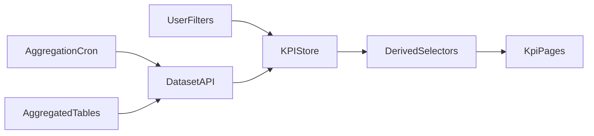

# KPI Dashboard Instant Filtering Plan

## Goal

Make all KPI pages respond visually instantly to any filter/toggle change after initial page load by shifting heavy aggregation off the request path and using in-memory slicing on the client.

## Current State (Key Touchpoints)

- Client hooks fetch per page from API routes, e.g. `/api/kpi/overview` in `[apps/web/src/app/api/kpi/overview/route.ts](apps/web/src/app/api/kpi/overview/route.ts)` and hooks in `[apps/web/src/features/kpi/hooks/use-kpi-data.ts](apps/web/src/features/kpi/hooks/use-kpi-data.ts)`.
- Filters are persisted in `[apps/web/src/features/kpi/hooks/use-persisted-filters.ts](apps/web/src/features/kpi/hooks/use-persisted-filters.ts)` and used by pages in `[apps/web/src/app/kpi/*/page.tsx](apps/web/src/app/kpi/...)`.
- Heavy aggregation happens server-side each request (Supabase queries + RPC + fallbacks) in `[apps/web/src/app/api/kpi/overview/route.ts](apps/web/src/app/api/kpi/overview/route.ts)`.

## Target Architecture

- **Pre-aggregated fact tables** in DB by day and key dimensions (source, campaign, stage, cohort, channel, Skool metrics).
- **Single “dataset” endpoint** to load all needed slices for a time window + dimensions once per session (or per period change), then filter in-memory on client.
- **Client-side state store** for dataset + filters + derived views to avoid re-fetch for each filter toggle.
- **Incremental refresh** via background revalidation (SWR/React Query) and optional live updates (polling or server-sent events).

## Plan Details

### 1) Data Model & Aggregation (Backend)

- Create/extend daily aggregate tables to include all filter dimensions needed for instant slicing (source, campaign, stage, channel, cohort, Skool metrics).
- Add rollup tables for expensive views (cohorts, expenses-by-channel) so UI can compute in-memory without DB scans.
- Ensure Skool KPIs are stored by day (already in `skool_metrics` and `skool_about_page_daily`), and align them with the same date range filters.
- Update cron pipelines (e.g., `[apps/web/src/app/api/cron/aggregate/route.ts](apps/web/src/app/api/cron/aggregate/route.ts)`) to materialize these aggregates nightly and optionally hourly for same-day freshness.

### 2) Unified Dataset Endpoint

- Add a new endpoint (e.g., `/api/kpi/dataset`) that returns:
  - Date-bucketed aggregates (by day) for leads/clients/revenue/spend.
  - Precomputed funnel counts by stage + by day.
  - Cohort tables pre-joined for the selected window.
  - Expenses by category/channel/month.
  - Latest Skool snapshot + about page historical series.
- Keep existing endpoints for backward compatibility but migrate pages to the dataset endpoint.

### 3) Client-Side Data Store & Slicing

- Introduce a centralized KPI store (e.g., Zustand or React Context) that:
  - Loads dataset once on initial page load.
  - Holds raw arrays in memory and exposes derived selectors for each page.
  - Applies filter changes synchronously in-memory (no network) to return derived views.
- Replace per-page `useKPIOverview`, `useFunnelData`, etc. with selectors that use cached dataset.
- Ensure `use-persisted-filters` drives the store, so any filter change instantly updates all pages.

### 4) Performance & UX Optimizations

- Precompute “hot” metrics for common filters (30d, 90d, YTD) server-side to reduce client compute time.
- Use memoized selectors for derived data to avoid recomputing large arrays on every render.
- Keep data payload size manageable with column pruning and compression (e.g., only fields used by UI).

### 5) Transition Strategy

- Implement dataset endpoint + store while keeping current API hooks working.
- Migrate pages one by one:
  - Overview/Skool → Funnel → Cohorts → Expenses
- Add feature flag to compare old vs new data pipeline if needed.

### 6) Validation & Instrumentation

- Add client-side timing logs for filter-change responsiveness.
- Add server-side metrics on dataset generation time and payload size.
- Confirm correctness by comparing outputs from old endpoints vs new store-derived values.

## Key Files to Change

- Data aggregation cron: `[apps/web/src/app/api/cron/aggregate/route.ts](apps/web/src/app/api/cron/aggregate/route.ts)`
- KPI API routes: `[apps/web/src/app/api/kpi/overview/route.ts](apps/web/src/app/api/kpi/overview/route.ts)` and new dataset endpoint
- Client hooks/store: `[apps/web/src/features/kpi/hooks/use-kpi-data.ts](apps/web/src/features/kpi/hooks/use-kpi-data.ts)` and new store module
- Pages: `[apps/web/src/app/kpi/page.tsx](apps/web/src/app/kpi/page.tsx)`, `[apps/web/src/app/kpi/funnel/page.tsx](apps/web/src/app/kpi/funnel/page.tsx)`, `[apps/web/src/app/kpi/cohorts/page.tsx](apps/web/src/app/kpi/cohorts/page.tsx)`, `[apps/web/src/app/kpi/expenses/page.tsx](apps/web/src/app/kpi/expenses/page.tsx)`, `[apps/web/src/app/kpi/skool/page.tsx](apps/web/src/app/kpi/skool/page.tsx)`

## Optional Diagram (Data Flow)

